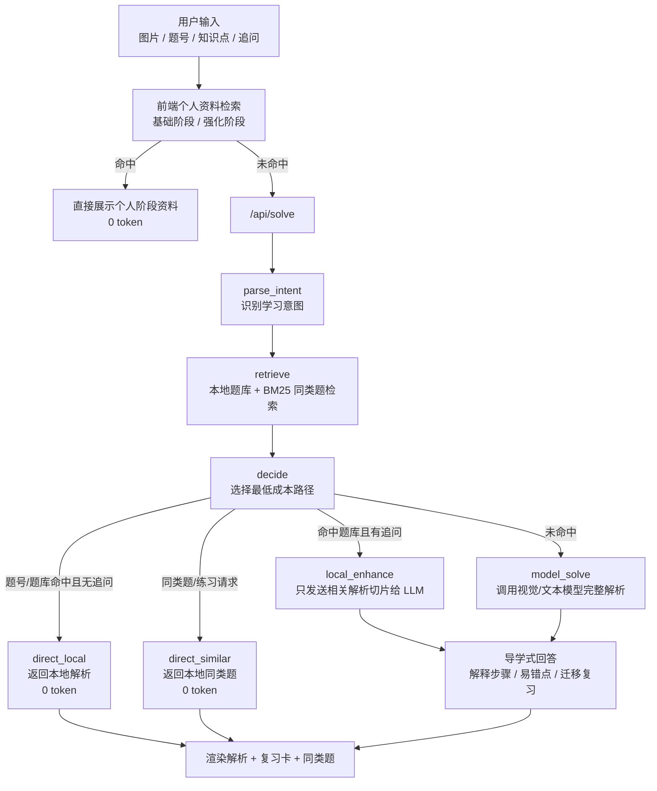

# 研数导学 Agent

一个面向考研数学学习的本地 Agent 助手。它不是简单把题目丢给大模型，而是先检索本地题库和个人学习资料，命中后再让 LLM 做低成本导学拓展。

项目目标是把考研数学学习做成一个闭环：

```text
识别考点 -> 看懂例题 -> 主动追问 -> 同类训练 -> 错因沉淀 -> 间隔复习
```

核心能力：

- 图片题目解析与纯文字追问
- 本地题库优先命中，减少 LLM token 消耗
- LangGraph 学习 Agent 工作流
- 轻量 RAG/BM25 同类题检索
- 基础/强化阶段学习资料管理
- 复习卡、收藏夹、学习中枢
- OpenAI-compatible API，适配 DeepSeek、硅基流动等模型服务

## 技术栈

- Frontend：原生 HTML / CSS / JavaScript，MathJax 渲染 LaTeX
- Backend：Node.js HTTP Server
- Agent：LangGraph JS
- Local Search：JSONL / SQLite / BM25 风格字段加权检索
- Desktop：Electron 原型
- Data Pipeline：Python 结构化题库构建脚本
- LLM API：OpenAI-compatible Chat Completions

## 开源数据说明

仓库内置一份小型 demo 数据，方便 clone 后直接跑通流程；完整题库可以在本地自行导入和构建。

- `data/processed-demo/`：可提交的小型演示数据，用于 clone 后跑通 demo。
- `data/raw/`：本地原始题库目录，默认不纳入仓库。
- `data/imports/`：本地导入文件目录，默认不纳入仓库。
- `data/processed/`：完整本地构建题库目录，默认不纳入仓库。

应用启动时会优先读取 `data/processed/`；如果不存在，则自动 fallback 到 `data/processed-demo/`。

## 启动

```bash
npm install
```

### 浏览器版本

现在推荐先使用浏览器版本，不依赖 Electron：

```bash
npm run web
```

然后打开：

```text
http://127.0.0.1:5188
```

Windows 侧可以直接双击：

```text
start-browser.bat
```

### 桌面版本

```bash
npm install
npm start
```

Windows 侧也可以直接双击：

```text
start-windows.bat
```

如果窗口提示 `Node.js is not installed on Windows`，说明不是程序闪退，而是 Windows 还缺 Node.js 运行环境。先安装 Node.js LTS：

```text
https://nodejs.org/
```

安装时保持默认选项即可。装好后重新双击 `start-windows.bat`。

## 项目结构

```text
.
├── src/
│   ├── server.js              # 浏览器版后端、LangGraph Agent、题库检索 API
│   ├── main.js                # Electron 主进程原型
│   ├── preload.js             # Electron preload
│   └── renderer/              # 前端页面、交互逻辑、样式
├── scripts/
│   ├── build_question_bank.py # 结构化题库构建脚本
│   └── self_check.js          # 项目自检脚本
├── prompts/                   # 批量生成解析与手工入库提示词
├── data/
│   ├── processed-demo/        # 开源 demo 数据
│   ├── raw/                   # 本地原始题库，默认忽略
│   ├── imports/               # 本地导入资料，默认忽略
│   └── processed/             # 本地完整题库，默认忽略
└── start-browser.bat          # Windows 浏览器版启动器
```

## 模型配置

应用默认按 OpenAI Chat Completions 兼容接口调用视觉模型。

常见填写方式：

```text
API 地址：https://api.openai.com/v1
模型名称：gpt-4o-mini
```

如果你使用其他 OpenAI 兼容服务，把 `API 地址` 填成该服务的 `/v1` 地址即可。应用会自动拼接 `/chat/completions`。

## 当前版本范围

当前推荐使用浏览器版本。浏览器版本已经接入本地题库、SQLite 数据库和轻量 RAG 切片；Electron 桌面窗口仍是早期直连模型原型，后续需要和浏览器后端合流。

浏览器版和桌面版都支持两种入口：

- 上传题目图片：适合拍照/截图解析原题
- 只输入文字：适合问知识点、按题号查题、追问某一步或让模型生成学习建议

## 学习阶段

学习中枢支持两个个人复习阶段，数据保存在浏览器本地 `localStorage` 的 `mathTutorStageMaterials` 中：

- 基础阶段：适合保存概念、公式、定理解释、常见题型和入门题。
- 强化阶段：适合保存综合题、证明题、技巧题、易错题和同类题训练。

解析结果工具栏中可以点击：

- `基`：把当前解析加入基础阶段。
- `强`：把当前解析加入强化阶段。

每条阶段资料会保存标题、内容、阶段、类型、来源题目、知识点、创建时间和掌握度字段。学习中枢中可以切换基础/强化阶段，查看对应资料并继续追问。

主提问框支持优先检索个人阶段资料，例如：

```text
基础阶段 泰勒公式
强化阶段 中值定理证明题
基础阶段 极限
强化阶段 易错题
```

如果个人阶段资料命中，会先展示你保存过的资料；如果没有命中，再继续走本地公共题库或模型 API。

已入库内容会写入：

- `data/processed/question_bank.jsonl`
- `data/processed/question_bank.sqlite`
- `data/processed/rag_chunks.jsonl`

## LangGraph Agent 架构

浏览器版后端的主解析入口 `/api/solve` 已接入 LangGraph 学习 Agent。它会把一次学习请求拆成“意图识别、检索、决策、输出”几步，尽量让本地资料先解决问题。



### Token 节省策略

- 题号命中：直接返回本地解析，不调用模型。
- 同类题推荐：直接返回本地 BM25 推荐，不调用模型。
- 追问某一步：只发送题目识别、解题思路、相关解答片段和易错点。
- 问知识点/复习：只发送知识点、思路和复习卡片，不发送整篇解析。
- 请求结构保持稳定，便于 DeepSeek 等模型服务复用上下文缓存。

## 本地题库增强流程

如果本地题库命中题目：

- 没写具体疑问：直接展示本地已有解析
- 写了具体疑问：把本地解析作为上下文，调用你配置的大模型 API 做导学式拓展
- 命中后会基于知识点、题型和题干关键词推荐同类题

示例：

```text
2020年第17题 为什么想到中心二项式系数？
```

这会先命中 `2020 数一 第 17 题`，再让模型围绕这个短问题进行拓展讲解。

题号检索支持常见写法，例如：

```text
2015年第一题
2015年第1题
15年数一第1题
05年数一第1题
```

本地会保存：

- 模型配置
- 最近 8 条解析记录

这些数据目前保存在 Electron 页面 localStorage 中。

## 自检

修改后可以运行：

```bash
npm run self-check
```

自检会临时启动一个本地服务，检查题库数量、RAG 切片数量、常见题号写法命中，以及纯文字问题不会被图片上传校验拦截。

主要后端接口：

- `GET /api/bank-stats`：题库和切片统计
- `POST /api/local-answer`：本地题库命中
- `POST /api/similar-questions`：轻量同类题推荐，使用题干、知识点、解题思路等字段加权检索
- `POST /api/enhance-local-answer`：基于本地解析调用模型拓展
- `POST /api/solve`：未命中时调用模型解析图片或文字问题

自然语言同类题检索示例：

```text
中值定理证明题
泰勒展开放缩
二重积分换元
矩阵特征值
正态分布参数估计
```
