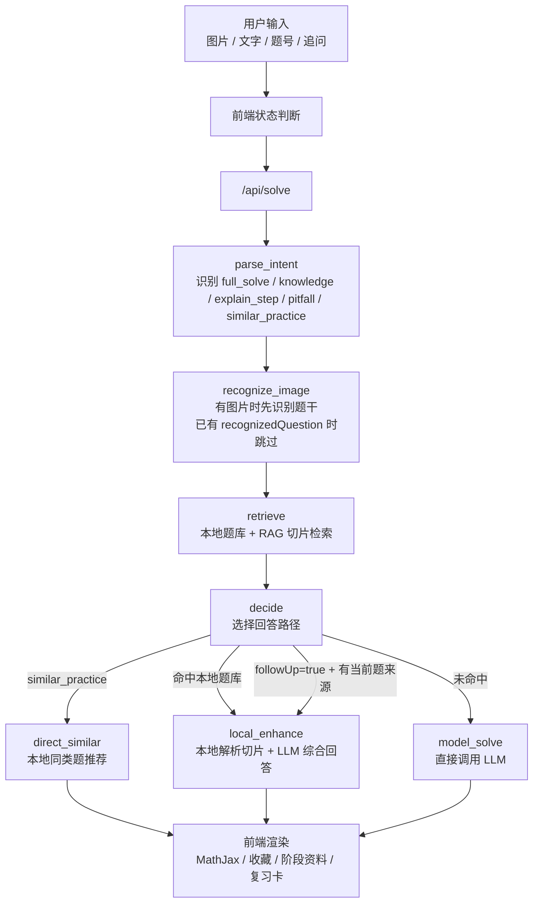

# 研数导学 Agent

一个本地优先的考研数学 AI 学习助手。项目目标不是做“拍照直接给答案”的 demo，而是把历年真题解析、本地知识库、视觉识题和大模型导学组织成一个可持续复习的学习产品。

当前主线体验：

```text
上传题目图片 / 输入文字问题
        ↓
视觉模型识别题干，用户校对公式与数字
        ↓
检索本地历年真题题库与 RAG 切片
        ↓
将命中的高质量解析作为上下文发送给 LLM
        ↓
生成结合题库资料与用户问题的导学式回答
        ↓
保存到基础 / 强化 / 收藏夹 / 复习卡，继续追问
```

## 当前完成情况

- **移动端优先前端**：米白色类 App 页面，桌面浏览器中居中显示，后续方便迁移到 Android WebView / Hybrid App。
- **首次 API 配置**：支持 API Key、API 地址、模型名称配置，内置 DeepSeek、硅基流动、Xiaomi MiMo 等 OpenAI-compatible 服务商预设。
- **图片题目识别**：上传图片后先调用视觉模型识别题干，并在同一个预览框内提供 LaTeX 渲染预览和编辑模式。
- **文字提问入口**：没有图片也可以直接输入题号、知识点或学习问题。
- **本地题库检索**：支持“2015年第一题”“2015年第1题”“15年数一第1题”“05年数一第1题”等题号表达。
- **本地资料 + LLM 综合回答**：点击“发送”后先检索本地题库，再把命中的解析切片和文本框问题一起交给 LLM 生成回答。
- **稳定追问路由**：点击“追问”会携带当前题目来源和当前解析上下文，强制进入追问拓展，不再重复返回本地原答案。
- **RAG / 同类题推荐**：基于题干、知识点、解题思路、复习卡片等字段做轻量检索，支持“泰勒公式同类题”“中值定理证明题”等自然语言搜索。
- **学习中枢**：支持基础阶段 / 强化阶段资料管理，复习卡已集成到中枢体系中。
- **收藏夹**：保存重要题目、解析或阶段资料，并可重新载入继续追问。
- **自检脚本**：检查题库数量、RAG 切片数量、题号识别、OCR 路径误命中保护、纯文字问题入口等。

## 技术栈

- **前端**：原生 HTML / CSS / JavaScript，MathJax 渲染 LaTeX
- **后端**：Node.js 原生 HTTP Server
- **Agent 工作流**：LangGraph JS
- **本地知识库**：JSONL 题库 + RAG 切片，SQLite 作为本地缓存文件
- **检索策略**：题号解析、字段加权文本检索、轻量 BM25 风格相似题检索
- **模型接口**：OpenAI-compatible Chat Completions
- **桌面原型**：Electron 入口保留，当前推荐使用浏览器版
- **数据构建**：Python 脚本将结构化 Markdown 解析构建为 `question_bank.jsonl` 与 `rag_chunks.jsonl`

## 数据范围

当前仓库包含按年份分类的 ChatGPT 网页生成结构化解析，以及由这些解析构建出的本地题库。

已入库数学一解析年份：

```text
2005, 2006, 2007, 2008, 2009, 2010,
2011, 2012, 2013, 2014, 2015, 2016,
2017, 2018, 2019, 2020, 2023, 2024
```

当前处理后数据规模：

```text
question_bank.jsonl: 414 题
rag_chunks.jsonl:    3171 个切片
```

数据目录说明：

```text
data/imports/          # 按年份分类的结构化 Markdown 解析
data/processed/        # 当前主知识库：question_bank.jsonl / rag_chunks.jsonl
data/processed-demo/   # 小型 demo 数据
data/raw-demo/         # demo 原始题目结构
data/raw/              # 本地原始资料目录，默认不提交
```

说明：仓库提交的是结构化文本知识库和 JSONL 检索数据；真实 API Key、`.env`、题目 PDF、截图图片、SQLite 缓存、`node_modules` 不纳入版本库。

## 快速启动

安装依赖：

```bash
npm install
```

启动浏览器版：

```bash
npm run web
```

打开：

```text
http://127.0.0.1:5188
```

Windows 也可以直接双击：

```text
start-browser.bat
```

桌面 Electron 原型：

```bash
npm start
```

当前推荐优先使用浏览器版，因为浏览器版已经接入完整本地题库、RAG 检索和 LangGraph 工作流。

## 模型配置

首次打开页面会进入 API 配置页，需要填写：

```text
API Key
API 地址
模型名称
```

示例：

```text
DeepSeek:
API 地址：https://api.deepseek.com/v1
模型名称：deepseek-chat

硅基流动:
API 地址：https://api.siliconflow.cn/v1
模型名称：Qwen/Qwen2.5-VL-32B-Instruct

Xiaomi MiMo:
API 地址：https://api.xiaomimimo.com/v1
模型名称：mimo-v2.5
```

图片识别需要选择支持视觉输入的模型。纯文本追问和知识点讲解可以使用普通文本模型。

## LangGraph 工作流



### 当前路由策略

- **发送**：先检索本地题库，再结合文本框问题调用 LLM 综合回答。
- **追问**：强制携带当前题目来源和当前解析上下文，进入追问拓展路由。
- **同类题推荐**：优先走本地 RAG 检索，减少不必要的模型调用。
- **图片路径**：先识别题干，再用识别文本检索本地题库，避免仅凭“第 5 题”之类弱信息误命中。

## 学习中枢

学习中枢用于长期复习沉淀，当前支持：

- 基础阶段：概念、公式、定理、常见题型、入门题
- 强化阶段：综合题、证明题、技巧题、易错题、同类题训练
- 复习卡：已集成到中枢
- 收藏夹：保存重要解析或资料
- 资料点击后可重新载入到学习页继续追问

前端本地数据主要保存在浏览器 `localStorage`：

```text
mathTutorConfig
mathTutorHistory
mathTutorFavorites
mathTutorReviewCards
mathTutorStageMaterials
```

## 常用问题示例

```text
2014年第2题
2015年第一题
泰勒公式怎么复习
给我推荐一道泰勒公式同类题
中值定理证明题
这一步为什么成立？
它有没有其他解法？
这个考点怎么迁移到同类题？
```

## 数据导入

将结构化 Markdown 解析放入：

```text
data/imports/<year>_math1/
```

然后运行构建脚本：

```bash
python scripts/build_question_bank.py
```

构建产物：

```text
data/processed/question_bank.jsonl
data/processed/rag_chunks.jsonl
data/processed/review_report.md
```

## 自检

```bash
npm run self-check
```

自检内容包括：

- 题库数量
- RAG 切片数量
- 常见题号表达命中
- 2014 线性插值题文本检索
- 图片 OCR 路径不能只凭题号误命中
- 同类题推荐
- 纯文字问题不会被图片校验拦截

当前通过规模：

```text
Questions: 414
RAG chunks: 3171
```

## 主要接口

```text
GET  /api/bank-stats
POST /api/local-answer
POST /api/similar-questions
POST /api/recognize-image
POST /api/solve
POST /api/enhance-local-answer
```

## 隐私与提交策略

`.gitignore` 已排除：

```text
.env
.env.*
node_modules/
.chatgpt-chrome-profile/
data/raw/
data/imports/**/*.pdf
data/imports/**/*.png
data/imports/**/*.jpg
data/processed/*.sqlite
```

仓库保留 `.env.example` 作为配置模板，不提交真实 API Key。

## 后续计划

- 增加真正的向量检索后端，补强知识点和题型相似度。
- 为 Android 端封装 WebView / Capacitor 版本。
- 增加学习记录统计、错题复习队列和间隔复习提醒。
- 对题库解析质量做自动校验和人工修订标记。
- 将视觉识题和题库检索结果做更清晰的可解释展示。

